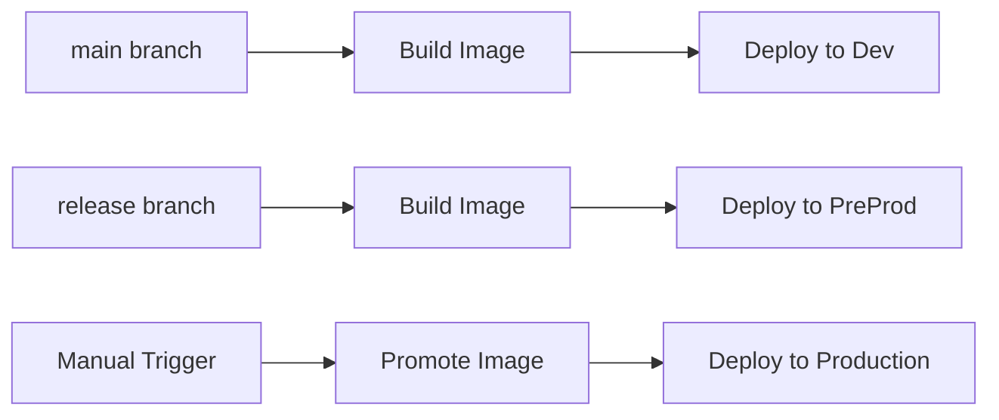

# Character Sheet Application - EKS Architecture Reference

## 🎯 Technical Overview

This document provides detailed technical specifications for the **multi-environment EKS architecture** with complete account isolation, advanced security controls, and automated CI/CD pipelines.

> **Note**: For setup instructions, see [MULTI_ENVIRONMENT_SETUP.md](MULTI_ENVIRONMENT_SETUP.md). For workflow details, see [WORKFLOW_SEPARATION.md](WORKFLOW_SEPARATION.md).

## 🏗️ Multi-Account Architecture

### **Account Structure**
```
┌─────────────────────────────────────────────────────────────────┐
│                    SHARED ACCOUNT                               │
│  ┌─────────────────┐  ┌─────────────────┐  ┌─────────────────┐  │
│  │ ECR Repository  │  │ Shared Logging  │  │ Terraform State │  │
│  │ (All Images)    │  │ (CloudWatch)    │  │ (Optional)      │  │
│  └─────────────────┘  └─────────────────┘  └─────────────────┘  │
└─────────────────────────────────────────────────────────────────┘
           │                    │                    │
           ▼                    ▼                    ▼
┌─────────────────┐  ┌─────────────────┐  ┌─────────────────┐
│   DEV ACCOUNT   │  │ PREPROD ACCOUNT │  │  PROD ACCOUNT   │
│                 │  │                 │  │                 │
│ EKS Cluster     │  │ EKS Cluster     │  │ EKS Cluster     │
│ RDS Database    │  │ RDS Database    │  │ RDS Database    │
│ VPC/Networking  │  │ VPC/Networking  │  │ VPC/Networking  │
│ IAM Roles       │  │ IAM Roles       │  │ IAM Roles       │
│ Secrets Manager │  │ Secrets Manager │  │ Secrets Manager │
└─────────────────┘  └─────────────────┘  └─────────────────┘
```

### **Cross-Account Access Patterns**
- **ECR Access**: Environment accounts pull images from shared ECR
- **Terraform State**: Optional shared state management 
- **Logging**: Centralized CloudWatch logging (optional)
- **IAM**: OIDC-based GitHub Actions access per account

## 📊 Environment Specifications

| Component | Dev | PreProd | Production |
|-----------|-----|---------|------------|
| **EKS Cluster** |
| Node Count | 1-2 | 2-3 | 3-6 |
| Instance Type | t3.medium | t3.large | m5.large |
| Availability Zones | 2 | 2 | 3 |
| **RDS Database** |
| Instance Class | db.t3.micro | db.t3.small | db.t3.medium |
| Multi-AZ | ❌ | ❌ | ✅ |
| Backup Retention | 0 days | 0 days | 7 days |
| **Networking** |
| NAT Gateway | ❌ | ❌ | ✅ |
| Public Subnets | 2 | 2 | 3 |
| Private Subnets | 2 | 2 | 3 |
| **Security** |
| WAF | Basic | Standard | Advanced |
| Geo-Restriction | ✅ | ✅ | ✅ |
| **Monitoring** |
| CloudWatch | Basic | Standard | Enhanced |
| Log Retention | 1 day | 3 days | 30 days |

## 🛡️ Security Architecture

### **Multi-Layer Security Controls**

#### **1. Account-Level Isolation**
- Complete AWS account separation between environments
- Cross-account access via IAM roles only
- Environment-specific IAM policies and permissions

#### **2. Network Security**
```
Internet Gateway
      │
      ▼
┌─────────────┐
│ Public ALB  │ ← WAF + Geo-Restriction
└─────────────┘
      │
      ▼
┌─────────────┐
│EKS Cluster  │ ← Security Groups + NACLs  
│ (Private)   │
└─────────────┘
      │
      ▼
┌─────────────┐
│ RDS         │ ← Private Subnets Only
│ (Private)   │
└─────────────┘
```

#### **3. Application Security**
- **External Secrets Operator**: No secrets in codebase
- **IRSA (IAM Roles for Service Accounts)**: Pod-level permissions
- **Service Mesh Ready**: Network policies and encryption

#### **4. WAF Configuration**
```hcl
# Geo-restriction rules
allowed_countries = ["US", "CA", "GB", "DE", "FR"]

# Rate limiting  
rate_limit = {
  requests_per_5min = 2000
  burst_capacity = 500
}

# Common attack protection
managed_rules = [
  "AWSManagedRulesCommonRuleSet",
  "AWSManagedRulesKnownBadInputsRuleSet"
]
```

## 🔧 Infrastructure Components

### **EKS Cluster Configuration**
```hcl
# Cluster settings
cluster_version = "1.28"
cluster_endpoint_private_access = true
cluster_endpoint_public_access = true

# Node groups
node_groups = {
  main = {
    instance_types = ["t3.medium", "t3.large"]
    capacity_type = "ON_DEMAND"
    
    scaling_config = {
      desired_size = var.node_count
      max_size = var.max_nodes
      min_size = 1
    }
  }
}

# Add-ons
cluster_addons = {
  coredns = { most_recent = true }
  kube-proxy = { most_recent = true }
  vpc-cni = { most_recent = true }
  aws-ebs-csi-driver = { most_recent = true }
}
```

### **RDS Configuration**
```hcl
# Database instance
instance_class = var.db_instance_class
engine = "postgres"
engine_version = "15.4"
allocated_storage = var.db_allocated_storage

# Security
db_subnet_group_name = aws_db_subnet_group.main.name
vpc_security_group_ids = [aws_security_group.rds.id]

# Backup and maintenance
backup_retention_period = var.backup_retention_period
backup_window = "03:00-04:00"
maintenance_window = "sun:04:00-sun:05:00"

# Encryption
storage_encrypted = true
kms_key_id = aws_kms_key.rds.arn
```

### **Secrets Management**
```yaml
# External Secrets architecture
ExternalSecrets Operator
├── SecretStore (AWS Secrets Manager)
├── ExternalSecret (Database credentials)
├── ExternalSecret (Application secrets)
└── Kubernetes Secrets (Generated)
```

## 🔄 CI/CD Architecture

### **GitHub Actions Integration**
```
GitHub Repository
├── Infrastructure Workflows (Manual)
│   ├── deploy-infrastructure.yml
│   └── deploy-networking.yml
└── Application Workflows (Automated + Manual)
    ├── deploy-applications.yml (branch-based)
    └── pr-validation.yml (automatic)
```

### **Image Management Flow**
```
Shared ECR Repository
├── character-sheet-backend:dev-{hash}-{timestamp}
├── character-sheet-backend:preprod-{hash}-{timestamp}  
├── character-sheet-backend:prod-{hash}-{timestamp}
├── character-sheet-backend:latest-dev
├── character-sheet-backend:latest-preprod
└── character-sheet-backend:latest-prod
```

### **Deployment Pipeline**


## 💰 Cost Analysis & Optimization

### **Monthly Cost Breakdown**

#### **Development Environment ($35-50)**
- EKS Cluster: $73/month (1 cluster)
- EC2 Instances: $25-40/month (1-2 t3.medium)
- RDS: $15-20/month (db.t3.micro)
- Load Balancer: $22/month
- NAT Gateway: $0 (cost optimization)
- EBS/Storage: $5-10/month

#### **PreProd Environment ($50-70)**  
- EKS Cluster: $73/month (1 cluster)
- EC2 Instances: $50-75/month (2-3 t3.large)
- RDS: $30-40/month (db.t3.small)
- Load Balancer: $22/month
- NAT Gateway: $0 (cost optimization)
- EBS/Storage: $10-15/month

#### **Production Environment ($120-150)**
- EKS Cluster: $73/month (1 cluster)
- EC2 Instances: $100-150/month (3-6 m5.large)
- RDS: $60-80/month (db.t3.medium, Multi-AZ)
- Load Balancer: $22/month
- NAT Gateway: $45/month (3 AZs)
- EBS/Storage: $15-25/month

#### **Shared Account ($5-10)**
- ECR Repository: $1-3/month
- CloudWatch Logs: $2-5/month
- Terraform State: $1-2/month

### **Cost Optimization Strategies**
- **Spot Instances**: Dev/PreProd can use spot instances (50-70% savings)
- **Scheduled Scaling**: Auto-shutdown non-prod environments after hours
- **EBS Optimization**: GP3 volumes with right-sized IOPS
- **NAT Gateway**: Removed from non-prod for cost savings

## 🔍 Monitoring & Observability

### **CloudWatch Integration**
```hcl
# EKS Cluster Logging
enabled_cluster_log_types = [
  "api", "audit", "authenticator", 
  "controllerManager", "scheduler"
]

# Application Logging  
log_groups = {
  "/aws/eks/${cluster_name}/cluster" = {
    retention_in_days = var.log_retention_days
  }
}
```

### **Metrics Collection**
- **Cluster Metrics**: CPU, memory, storage, network
- **Application Metrics**: Request rate, response time, error rate
- **Database Metrics**: Connections, query performance, storage
- **Cost Metrics**: Per-environment spending tracking

## 🔧 Operational Procedures

### **Scaling Operations**
```bash
# Manual cluster scaling
kubectl scale deployment backend-deployment --replicas=5

# HPA configuration  
kubectl autoscale deployment backend-deployment \
  --cpu-percent=70 --min=2 --max=10
```

### **Backup & Recovery**
```bash
# Database backups (automated)
aws rds create-db-snapshot \
  --db-instance-identifier character-sheet-prod \
  --db-snapshot-identifier manual-snapshot-$(date +%Y%m%d)

# EKS cluster backup (via Velero)
velero backup create cluster-backup-$(date +%Y%m%d)
```

### **Security Scanning**
```yaml
# Container scanning (integrated in CI/CD)
- name: Run Trivy vulnerability scanner
  uses: aquasecurity/trivy-action@master
  with:
    image-ref: ${{ env.IMAGE_URI }}
    format: 'sarif'
    output: 'trivy-results.sarif'
```

## 📈 Performance Characteristics

### **Expected Performance Metrics**
| Environment | Concurrent Users | Response Time (p95) | Throughput (RPS) |
|-------------|------------------|---------------------|------------------|
| Dev | 10-50 | < 500ms | 50-100 |
| PreProd | 50-200 | < 300ms | 200-500 |
| Production | 500-2000 | < 200ms | 1000-5000 |

### **Resource Utilization Targets**
- **CPU**: 60-70% average, 90% peak
- **Memory**: 70-80% average, 95% peak  
- **Database**: < 80% connections, < 200ms query time
- **Storage**: < 80% capacity with auto-scaling

---

**Architecture Questions?** This document covers technical implementation details. For setup guidance, see [MULTI_ENVIRONMENT_SETUP.md](MULTI_ENVIRONMENT_SETUP.md). 