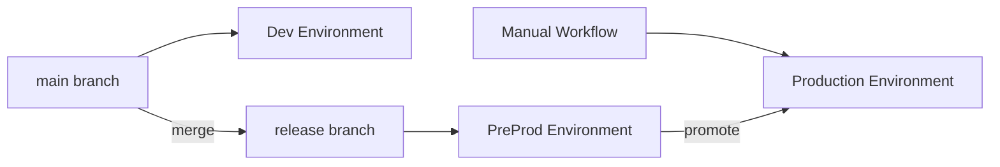
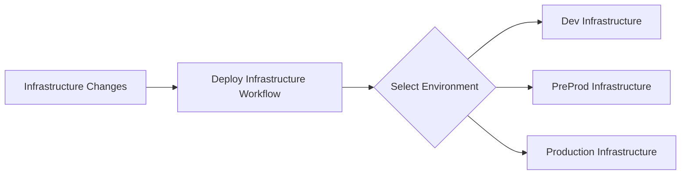
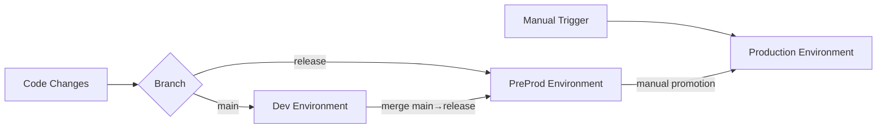

# GitHub Workflows Separation Guide
# ====================================
# Infrastructure vs Application Deployment Separation

## 🏗️ Overview

The GitHub Actions workflows have been **separated** to provide clear distinction between infrastructure and application deployments with a **proper branch-based promotion flow**:

### **New Workflow Structure**
- **🔧 Deploy Infrastructure** (Manual) - Infrastructure changes for all environments
- **🚀 Deploy Applications** (Branch-based CI/CD + Manual) - Application deployments
- **🌐 Deploy Networking** (Manual) - Shared infrastructure deployment  
- **✅ PR Validation** (Automatic) - Pull request validation

### **Branch-Based Deployment Flow**


**Flow:**
- **`main` branch** → **Dev Environment** (automatic CI/CD)
- **`release` branch** → **PreProd Environment** (automatic CI/CD)
- **Manual workflow** → **Production Environment** (controlled release)

## 🔄 Deployment Flow

### **Infrastructure Deployment (Manual Only)**


**Workflow:** `Deploy Infrastructure`
- **Trigger:** Manual only (`workflow_dispatch`)
- **Purpose:** Deploy/update infrastructure (EKS, RDS, Networking, etc.)
- **Environments:** Dev, PreProd, Production (one at a time)
- **Actions:** Plan, Apply, Destroy

### **Application Deployment (Branch-based CI/CD + Manual)**


**Workflow:** `Deploy Applications`
- **Automatic:** 
  - `main` branch → Dev Environment
  - `release` branch → PreProd Environment
- **Manual:** Production deployments (requires manual trigger)
- **Purpose:** Deploy application code and configurations

## 📋 Workflow Details

### **1. Deploy Infrastructure** 
**File:** `.github/workflows/deploy-infrastructure.yml`

**Triggers:**
- Manual only (`workflow_dispatch`)

**Inputs:**
- `environment`: dev | preprod | prod
- `action`: plan | apply | destroy
- `confirm_destroy`: Required for destroy actions

**Features:**
- ✅ Environment-specific infrastructure deployment
- ✅ Terraform plan/apply/destroy actions
- ✅ Destroy confirmation safety mechanism
- ✅ Separate AWS account access per environment
- ✅ Comprehensive output and error reporting

**Usage:**
```bash
# Deploy dev infrastructure
Actions → Deploy Infrastructure → environment: dev, action: apply

# Update production infrastructure  
Actions → Deploy Infrastructure → environment: prod, action: apply

# Destroy preprod infrastructure (careful!)
Actions → Deploy Infrastructure → environment: preprod, action: destroy, confirm_destroy: CONFIRM
```

### **2. Deploy Applications**
**File:** `.github/workflows/deploy-applications.yml`

**Triggers:**
- **Automatic:** Push to `main` or `release` branches (backend/frontend changes)
- **Manual:** `workflow_dispatch` for any environment

**Branch-based Flow:**
```bash
# Development Flow
git checkout main
git add .
git commit -m "feat: new feature"
git push origin main
# → Automatically deploys to Dev

# PreProd Flow  
git checkout release
git merge main
git push origin release
# → Automatically deploys to PreProd

# Production Flow (Manual)
Actions → Deploy Applications → target_environment: prod, source_image_tag: latest-preprod
```

**Features:**
- ✅ Branch-based automatic deployments
- ✅ Image tagging per environment (dev-*, preprod-*, prod-*)
- ✅ Production deployments require manual approval
- ✅ Enhanced health checks for production
- ✅ Kubernetes deployment management

### **3. Deploy Networking** 
**File:** `.github/workflows/deploy-networking.yml`

**Purpose:** Deploy shared infrastructure (ECR, networking, cross-account policies)
- **Trigger:** Manual or shared infrastructure changes
- **Scope:** Shared AWS account resources
- **Updates:** Environment configurations automatically

### **4. PR Validation**
**File:** `.github/workflows/pr-validation.yml`

**Purpose:** Validate pull requests
- **Trigger:** Pull request creation/updates
- **Scope:** Terraform validation, security scanning, testing
- **Environments:** Validates all environment configurations

## 🌿 Branch Strategy

### **main Branch (Development)**
- **Purpose:** Active development and feature integration
- **Target:** Dev Environment
- **Flow:** Feature branches → main → Dev deployment
- **Frequency:** Multiple times per day

### **release Branch (Pre-Production)**
- **Purpose:** Release candidates and testing
- **Target:** PreProd Environment  
- **Flow:** main → release → PreProd deployment
- **Frequency:** Weekly/bi-weekly releases

### **Production Deployment (Manual)**
- **Purpose:** Production releases
- **Target:** Production Environment
- **Flow:** Manual promotion from PreProd images
- **Frequency:** Monthly/quarterly releases

## 🔄 Migration from Legacy Workflows

### **Deprecated Workflows:**
- ~~`deploy-dev-preprod.yml`~~ → Use `deploy-applications.yml`
- ~~`deploy-production.yml`~~ → Use `deploy-applications.yml`

### **Migration Steps:**

1. **First-time Setup:**
   ```bash
   # 1. Deploy shared infrastructure
   Actions → Deploy Networking → action: apply
   
   # 2. Deploy environment infrastructure  
   Actions → Deploy Infrastructure → environment: dev, action: apply
   Actions → Deploy Infrastructure → environment: preprod, action: apply
   Actions → Deploy Infrastructure → environment: prod, action: apply
   
   # 3. Create release branch
   git checkout -b release
   git push origin release
   
   # 4. Application deployments now work automatically
   git checkout main
   git push origin main  # Deploys to dev
   
   git checkout release
   git merge main
   git push origin release  # Deploys to preprod
   ```

2. **Ongoing Usage:**
   ```bash
   # Infrastructure changes (when needed)
   Actions → Deploy Infrastructure → environment: [env], action: apply
   
   # Development workflow
   git checkout main
   # ... make changes ...
   git push origin main  # Auto: deploys to dev
   
   # Release workflow
   git checkout release
   git merge main
   git push origin release  # Auto: deploys to preprod
   
   # Production workflow
   Actions → Deploy Applications → target_environment: prod  # Manual: production
   ```

## 🚦 Deployment Environments

### **Development Environment**
- **Branch:** `main`
- **Infrastructure:** Manual deployment required
- **Applications:** Automatic on `main` branch pushes
- **Purpose:** Active development and feature testing
- **Image Tag:** `dev-{commit}-{timestamp}`

### **PreProd Environment**  
- **Branch:** `release`
- **Infrastructure:** Manual deployment required
- **Applications:** Automatic on `release` branch pushes
- **Purpose:** Release candidate validation and integration testing
- **Image Tag:** `preprod-{commit}-{timestamp}`

### **Production Environment**
- **Branch:** Manual (promotes from PreProd)
- **Infrastructure:** Manual deployment required  
- **Applications:** Manual deployment required
- **Purpose:** Production workloads
- **Image Tag:** `prod-{commit}-{timestamp}`
- **Safety:** Enhanced health checks and verification

## 🔐 Security & Safety

### **Infrastructure Deployments:**
- ✅ Manual approval required for all infrastructure changes
- ✅ Environment isolation (separate AWS accounts)
- ✅ Destroy confirmation mechanism
- ✅ Terraform state management

### **Application Deployments:**
- ✅ Branch-based automatic CI/CD for dev/preprod (rapid iteration)
- ✅ Manual production deployments (controlled releases)
- ✅ Image promotion between environments
- ✅ Health checks and rollback capabilities

### **Branch Protection:**
- ✅ `main` branch: Development integration
- ✅ `release` branch: Stable release candidates
- ✅ Production: Manual promotion from tested preprod images

### **Cross-Account Security:**
- ✅ OIDC authentication (no long-lived secrets)
- ✅ Least privilege IAM roles
- ✅ Cross-account ECR access policies
- ✅ Environment-specific secret management

## 📊 Workflow Comparison

| Aspect | Infrastructure | Applications (Dev) | Applications (PreProd) | Applications (Prod) |
|--------|---------------|--------------------|------------------------|---------------------|
| **Trigger** | Manual only | `main` branch push | `release` branch push | Manual only |
| **Frequency** | Occasional | Multiple/day | Weekly | Monthly |
| **Scope** | EKS, RDS, VPC | Dev features | Release candidates | Production releases |
| **Duration** | 15-25 min | 10-15 min | 10-15 min | 15-20 min |
| **Risk Level** | High | Low | Medium | High |

## 🎯 Best Practices

### **Infrastructure:**
1. **Plan First:** Always run `plan` before `apply`
2. **Review Changes:** Carefully review Terraform plans
3. **Environment Order:** Deploy dev → preprod → production
4. **Backup:** Ensure state file backups exist

### **Applications:**
1. **Development Flow:** 
   - Create feature branches from `main`
   - Merge to `main` for dev deployment
   - Test thoroughly in dev environment

2. **Release Flow:**
   - Merge `main` to `release` when ready for preprod
   - Test release candidate in preprod
   - Only promote stable releases to production

3. **Production:**
   - Only deploy after successful preprod validation
   - Use manual workflow for controlled releases
   - Monitor health checks and logs after deployment

### **Branch Management:**
1. **main Branch:** Keep stable, regularly tested code
2. **release Branch:** Only merge tested code from main
3. **Feature Branches:** Create from main, merge back to main
4. **Hotfixes:** Apply to both main and release as needed

### **General:**
1. **Dependencies:** Deploy infrastructure before applications
2. **Validation:** Use PR validation to catch issues early
3. **Documentation:** Keep this guide updated with changes
4. **Communication:** Coordinate infrastructure changes with team

## 🔗 Quick Links

- **Shared Infrastructure:** [Deploy Networking Workflow](/.github/workflows/deploy-networking.yml)
- **Infrastructure:** [Deploy Infrastructure Workflow](/.github/workflows/deploy-infrastructure.yml)  
- **Applications:** [Deploy Applications Workflow](/.github/workflows/deploy-applications.yml)
- **Validation:** [PR Validation Workflow](/.github/workflows/pr-validation.yml)
- **Multi-Environment Setup:** [MULTI_ENVIRONMENT_SETUP.md](/MULTI_ENVIRONMENT_SETUP.md)

## 🔄 Example Workflows

### **Feature Development:**
```bash
# 1. Create feature branch
git checkout main
git pull origin main
git checkout -b feature/new-feature

# 2. Develop and test locally
# ... make changes ...
git add .
git commit -m "feat: add new feature"

# 3. Create PR to main
git push origin feature/new-feature
# Create PR: feature/new-feature → main

# 4. After PR approval, merge to main
git checkout main
git pull origin main
# → Automatically deploys to Dev environment
```

### **Release Process:**
```bash
# 1. Prepare release
git checkout release
git pull origin release
git merge main

# 2. Deploy to PreProd
git push origin release
# → Automatically deploys to PreProd environment

# 3. Test in PreProd
# ... validate release candidate ...

# 4. Deploy to Production (when ready)
Actions → Deploy Applications → target_environment: prod, source_image_tag: latest-preprod
```

### **Hotfix Process:**
```bash
# 1. Create hotfix from main
git checkout main
git checkout -b hotfix/critical-fix

# 2. Apply fix
git add .
git commit -m "fix: critical security issue"

# 3. Merge to main
# Create PR: hotfix/critical-fix → main
# → Deploys to Dev for testing

# 4. Cherry-pick to release
git checkout release
git cherry-pick <commit-hash>
git push origin release
# → Deploys to PreProd

# 5. Deploy to Production
Actions → Deploy Applications → target_environment: prod
```

---

**Note:** This branch-based workflow provides clear separation of concerns and controlled promotion paths. The `main` branch serves as the source of truth for development, while the `release` branch acts as a gatekeeper for production-ready code. 